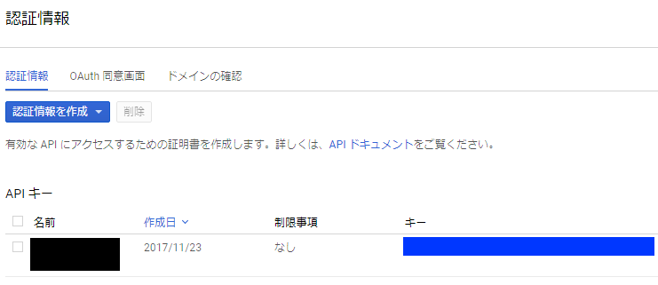

<!-- [](https://circleci.com/gh/corselia/character-recognition-by-vision-api/tree/master) -->

# Overview
- you get the characters as text format from the image file with characters
    - first step
        - you prepare the image file with characters (any language, of course Japanese too)
        - you prepare the `API Key` of `Google Cloud Vision API`
    - second step
        - exec method in this gem
    - third step
        - you get the characters as text format :)

# Installation
```ruby
$ gem install character_recognition_by_vision_api
```

# Usage

#### 1. prepare the image file
- in this repository, I prepare [sample_image.png](spec/sample_image.png)


#### 2. prepare api_key of Google Cloud Vision API
- the official site of Google Cloud Vision API is here
    - [Vision API | Google Cloud Platform](https://cloud.google.com/vision/)
- you acquire `API Key` at [Google Cloud Platform Service](https://console.cloud.google.com/)
    - the detail of procedure is omitted on this document
    - the blue part of below image contains `API Key`



#### 3. require gem
```ruby
require 'character_recognition_by_vision_api'
```

#### 4. exec method
```ruby
CharacterRecognitionByVisionApi.extract_to_text(image_file, api_key)
```

#### 5. return the characters as text format
- 🎉you get the characters as text format🎉

# Example

#### when the image file is below


#### the result is here

```
あいうえおかきくけこさしすせそた
ちってとなにぬねのはひふへぼまみ
むめもやゆよらりる丸ろわをんーゑ
H本語表示サンプJ 1 2 3 4 5 60
ABCDE FGHIJKLMNOP
```

- looks almost good :)

## Development

After checking out the repo, run `bin/setup` to install dependencies. Then, run `rake spec` to run the tests. You can also run `bin/console` for an interactive prompt that will allow you to experiment.

To install this gem onto your local machine, run `bundle exec rake install`. To release a new version, update the version number in `version.rb`, and then run `bundle exec rake release`, which will create a git tag for the version, push git commits and tags, and push the `.gem` file to [rubygems.org](https://rubygems.org).

## Contributing

Bug reports and pull requests are welcome on GitHub at https://github.com/corselia/character-recognition-by-vision-api.

## License

The gem is available as open source under the terms of the [MIT License](https://opensource.org/licenses/MIT).
